# GreenTide - 全能型游戏增强工具

GreenTide 是一款全能型游戏增强工具，专为突破游戏原生限制、拓展游玩体验而生。它能轻松将不支持动作操作的游戏改造为动作适配模式，让操控更随心；内置自由录制键盘与鼠标操作功能，精准捕捉每一步指令，搭配自定义鼠标宏，轻松简化复杂操作流程；同时支持手柄配置适配，让不支持手柄的游戏也能享受沉浸式操控手感。更能实现游戏组网功能，一键搭建联机环境，与好友畅享联机乐趣，全方位升级你的游戏体验。

---

## 📋 目录

- [主要功能](#主要功能)
  - [动作模式](#动作模式)
  - [键盘宏](#键盘宏)
  - [自动化脚本](#自动化脚本)
  - [手柄设置](#手柄设置)
  - [游戏加速器](#游戏加速器)
  - [设置](#设置)
  - [软件支持](#软件支持)
- [使用技巧](#使用技巧)
- [常见问题](#常见问题)

---

## 🎮 主要功能

### 动作模式

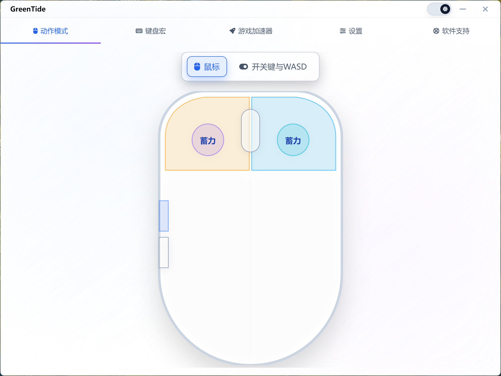

动作模式是 GreenTide 的核心功能之一，它能够将不支持动作操作的游戏改造为动作适配模式，让您享受更流畅的游戏操控体验。

#### 鼠标配置面板

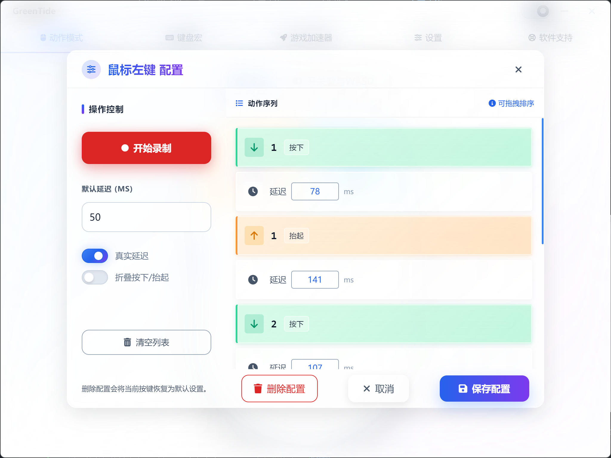

在动作模式的鼠标面板中，您可以配置以下鼠标按键：

- **鼠标左键**：配置左键的宏动作，支持录制键盘按键、鼠标点击和延时等操作
- **鼠标右键**：配置右键的宏动作，适用于需要右键触发复杂操作的场景
- **鼠标中键（滚轮）**：配置中键的宏动作，充分利用鼠标中键功能
- **侧键1/侧键2**：配置鼠标侧键的宏动作，适合多按键游戏鼠标
- **左键蓄力/右键蓄力**：长按鼠标按键超过 200ms 会触发蓄力热键，适用于需要区分短按和长按的场景

配置后的鼠标按键会在界面上以**彩色高亮**显示，方便您快速识别已配置的按键。每个按键都可以独立配置不同的宏动作序列，支持复杂的操作组合。

#### 开关键与 WASD 设置

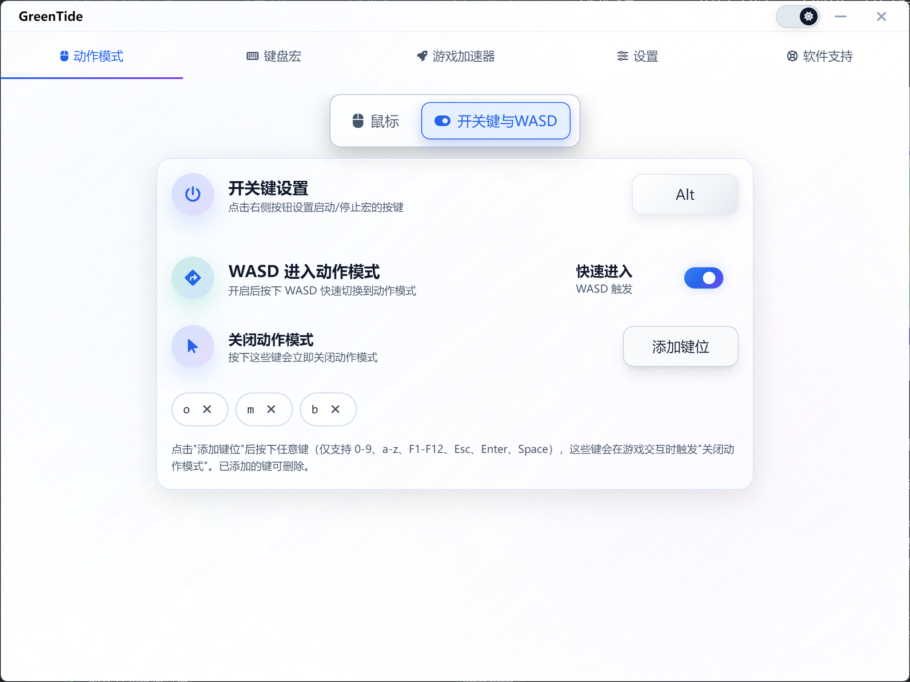

在开关键与 WASD 设置面板中，您可以配置：

- **开关键设置**：设置启动/停止宏的触发按键。按下此键后，所有配置的宏动作将开始执行或停止执行
- **WASD 进入动作模式**：开启此功能后，按下 WASD 键中的任意一个即可快速切换到动作模式，无需手动开启
- **关闭动作模式按键**：设置多个按键，按下这些按键后会自动禁用所有脚本，方便快速退出动作模式。支持 0-9、a-z、F1-F12、Esc、Enter、Space 等按键
- **游戏动作模式**：如果游戏自带动作模式，可以开启此选项，让软件与游戏原生动作模式协同工作

这些设置让您能够灵活控制动作模式的开启和关闭，适应不同的游戏场景和操作习惯。

---

### 键盘宏

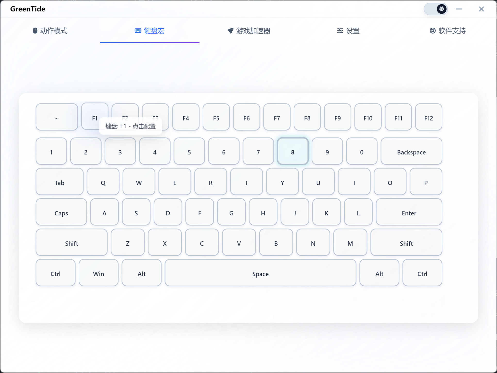

键盘宏功能允许您为任意键盘按键配置宏动作，支持所有键盘按键，包括字母、数字、功能键、修饰键等。

#### 可视化键盘布局

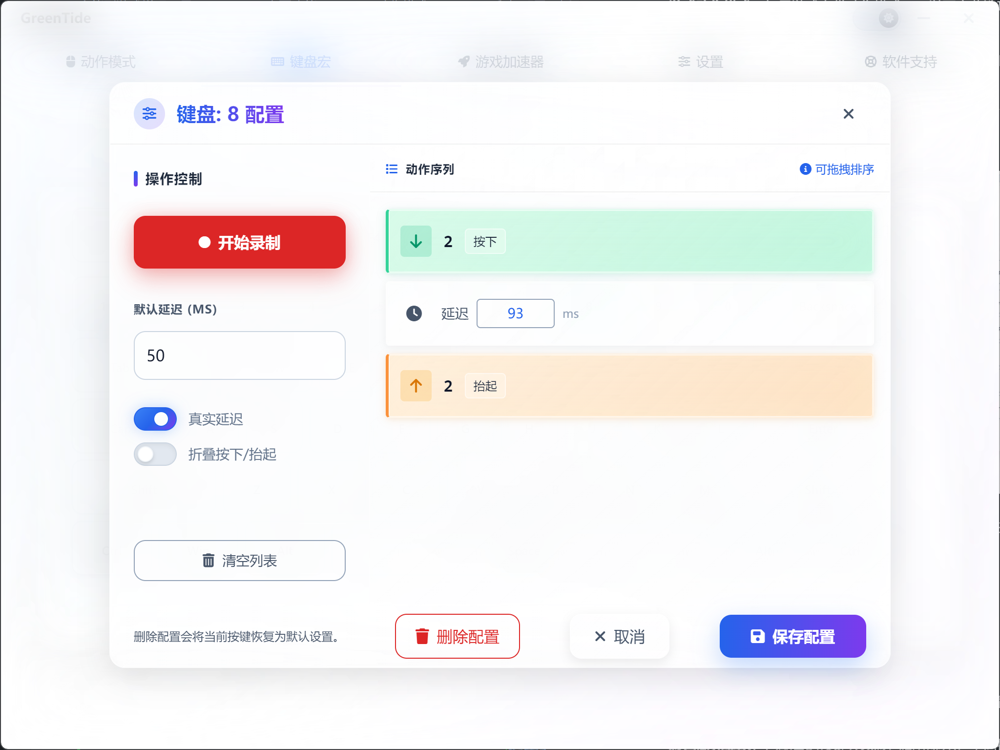

GreenTide 提供了直观的可视化键盘布局界面，您可以：

- **点击任意按键**：直接点击键盘布局中的按键即可开始配置该按键的宏动作
- **彩色高亮显示**：已配置的按键会以彩色高亮显示，不同按键使用不同的颜色，方便识别
- **实时状态更新**：配置保存后，按键颜色会立即更新，无需刷新页面

#### 宏动作录制

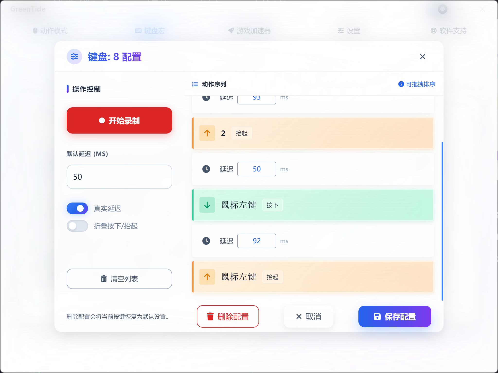

为键盘按键配置宏动作时，您可以：

- **录制键盘操作**：录制按键序列，包括单键、组合键等
- **录制鼠标操作**：录制鼠标点击、移动等操作
- **添加延时**：在动作序列中添加延时，确保操作流畅自然
- **编辑动作序列**：对已录制的动作进行编辑、删除、调整顺序等操作

配置完成后，按下对应的键盘按键即可自动执行配置的宏动作，适用于游戏连招、快速操作、重复任务等场景。

---

### 自动化脚本

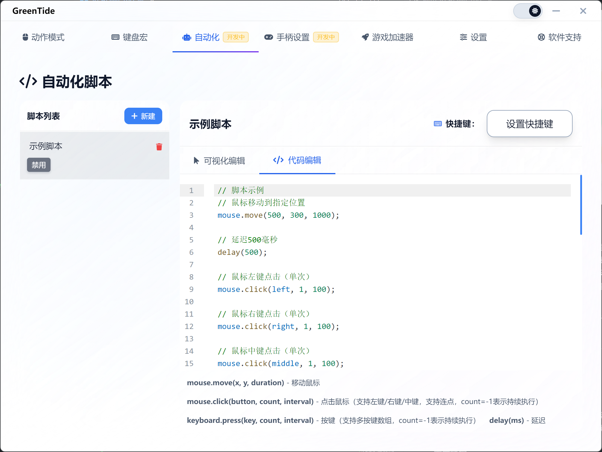

自动化脚本功能提供了强大的脚本编辑能力，支持可视化编辑和代码编辑两种方式，让您能够创建复杂的自动化操作流程。

#### 脚本管理

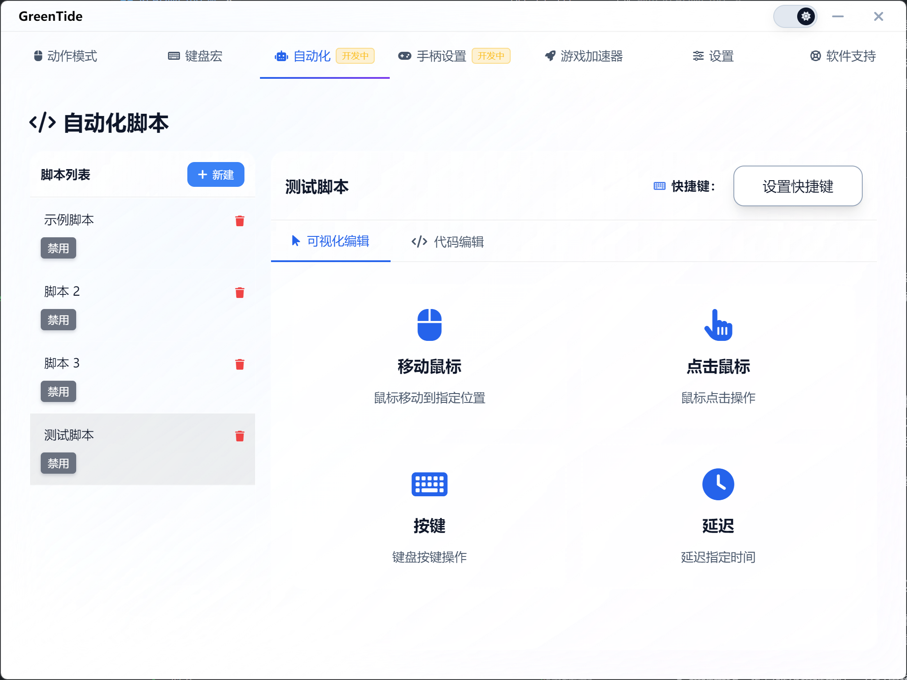

- **创建脚本**：可以创建多个脚本，每个脚本都有独立的名称和配置
- **脚本列表**：左侧显示所有脚本列表，可以快速切换和编辑
- **启用/禁用**：每个脚本都可以独立启用或禁用，方便控制脚本的执行
- **快捷键设置**：为每个脚本设置快捷键，按下快捷键即可执行脚本

#### 可视化编辑

可视化编辑模式提供了直观的操作界面，支持以下操作：

- **移动鼠标**：设置鼠标移动到指定坐标位置，支持设置移动时长
- **点击鼠标**：配置鼠标点击操作，支持左键、右键、中键，可以设置点击次数和间隔时间
- **按键操作**：配置键盘按键操作，支持单按键和多按键组合，可以设置按键次数和间隔时间
- **延迟操作**：在操作序列中添加延迟，确保操作之间的时间间隔

通过可视化编辑，即使不熟悉编程的用户也能轻松创建自动化脚本。

#### 代码编辑

对于高级用户，GreenTide 提供了代码编辑模式，支持 JavaScript 语法，可以编写更复杂的自动化脚本。

**支持的 API：**

- `mouse.move(x, y, duration)` - 移动鼠标到指定位置
- `mouse.click(button, count, interval)` - 点击鼠标（支持 left/right/middle，count=-1 表示持续执行）
- `keyboard.press(key, count, interval)` - 按键操作（支持多按键数组，count=-1 表示持续执行）
- `delay(ms)` - 延迟指定时间

代码编辑器提供了语法高亮、自动补全等功能，让编写脚本更加便捷。

---

### 手柄设置

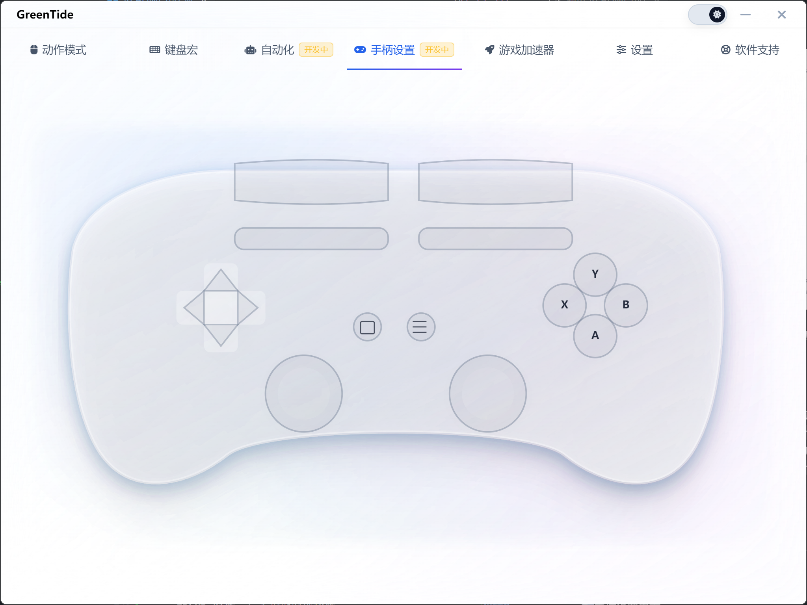

手柄设置功能让不支持手柄的游戏也能享受沉浸式操控手感。GreenTide 提供了完整的手柄按键映射功能。

#### 可视化手柄布局

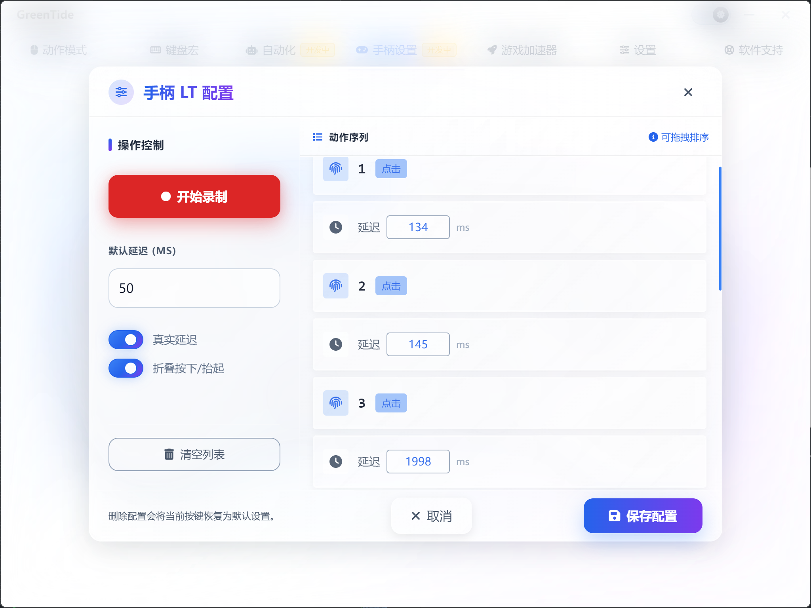

GreenTide 提供了直观的手柄可视化界面，支持配置以下手柄按键：

- **A/B/X/Y 按键**：游戏手柄的主要操作按键
- **LB/RB 肩键**：手柄的肩部按键
- **LT/RT 扳机键**：手柄的扳机按键
- **十字键**：手柄的方向键（上/下/左/右）
- **左摇杆/右摇杆按下**：摇杆按下操作
- **选择/开始键**：手柄的菜单按键

#### 按键映射配置

点击手柄上的任意按键即可开始配置：

- **映射到键盘**：将手柄按键映射到键盘按键，实现手柄控制键盘操作
- **映射到鼠标**：将手柄按键映射到鼠标操作，如点击、移动等
- **宏动作配置**：为手柄按键配置复杂的宏动作序列

配置完成后，使用手柄即可在原本不支持手柄的游戏中享受手柄操控的便利。

---

### 游戏加速器

游戏加速器功能集成了浪徒网游加速器，为多款热门游戏提供专业的网络加速服务。

#### 支持的 games

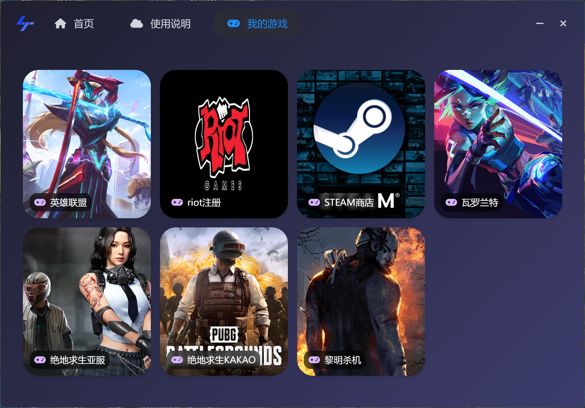

GreenTide 游戏加速器支持以下游戏：

- **韩服英雄联盟**：畅玩韩服英雄联盟，享受超低延迟游戏体验
- **瓦洛兰特**：为瓦洛兰特提供专业游戏加速服务，降低延迟，提升帧率
- **绝地求生**：PUBG 游戏加速，智能路由，稳定不掉线
- **黎明杀机**：Dead by Daylight 专用加速，流畅游戏体验

#### 一键加速

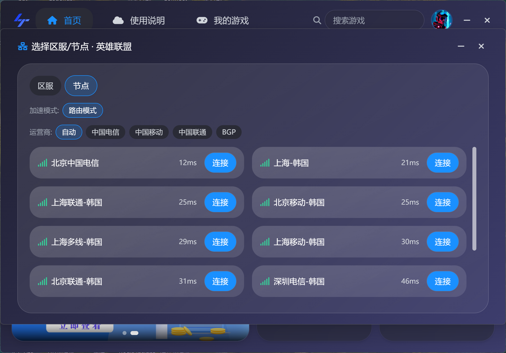

- **免费试用**：新用户可免费试用 10 天
- **一键下载**：点击"立即下载"按钮即可自动下载并安装加速器
- **自动安装**：下载完成后自动运行安装程序
- **稳定可靠**：专业的加速线路，确保游戏连接稳定

游戏加速器可以帮助您解决网络延迟、掉线等问题，让您享受更流畅的游戏体验。

---

### 设置

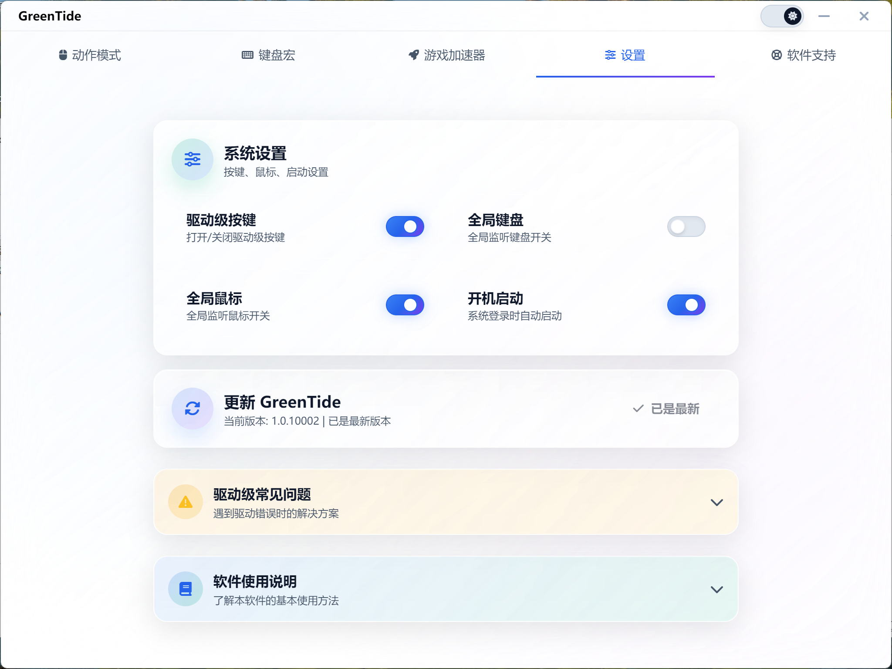

设置面板提供了丰富的系统配置选项，让您能够根据个人需求定制软件行为。

#### 系统设置

- **驱动级按键**：开启后使用驱动层发送按键，几乎兼容所有游戏。多数游戏无需开启，遇到按键不生效再打开。开启后如遇"驱动错误"，请先关闭 Windows"内存完整性"
- **全局键盘**：开启后按键只对本软件生效，游戏内按键被占用；关闭则游戏与软件可同时生效
- **全局鼠标**：开启后鼠标只对本软件生效，游戏内鼠标被占用；关闭则游戏与软件可同时生效。如果游戏支持动作模式建议关闭全局鼠标，避免与游戏内鼠标操作冲突
- **开机启动**：开启后随系统登录自动启动本软件；关闭则需手动启动。建议开启以便随时使用宏功能

#### 软件更新

- **自动检查更新**：软件会自动检查是否有新版本可用
- **版本信息显示**：显示当前版本和最新版本信息
- **一键更新**：发现新版本后，点击"立即更新"按钮即可自动下载并安装
- **更新进度**：下载和安装过程中会显示详细的进度信息

#### 使用说明

设置面板中还包含了详细的使用说明和常见问题解答：

- **动作模式使用说明**：详细介绍动作模式的配置和使用方法
- **键盘宏使用说明**：说明键盘宏的配置技巧和注意事项
- **驱动级常见问题**：解答驱动级按键使用中可能遇到的问题
- **使用技巧**：提供一些实用的使用技巧和最佳实践

---

### 软件支持

软件支持页面提供了多种联系方式，方便您获取帮助和支持。

#### 官方网站

- **网站地址**：GreenTeng.com
- **功能**：访问官方网站了解更多信息、查看最新动态、下载最新版本

#### QQ 交流群

- **群号**：248527445
- **功能**：加入 QQ 交流群，与其他用户交流使用经验，获取技术支持，提出功能建议
- **一键复制**：点击群号卡片即可自动复制群号，方便快速加入

#### 版本信息

软件支持页面还会显示当前软件的版本信息，方便您了解使用的软件版本。

---

## 💡 使用技巧

### 1. 宏动作配置技巧

- **录制完整序列**：建议先录制完整的动作序列，然后根据实际需求调整延时时间
- **测试和调整**：在实际游戏环境中测试宏动作，根据游戏响应速度调整延时
- **避免过快操作**：不要设置过短的延时，避免动作过快导致失败
- **使用鼠标蓄力**：对于需要区分短按和长按的场景，可以使用鼠标蓄力功能

### 2. 动作模式优化

- **合理设置开关键**：选择一个不常用的按键作为开关键，避免误触
- **配置关闭按键**：设置多个关闭动作模式的按键，方便快速退出
- **WASD 快速进入**：开启 WASD 模式，可以快速进入动作模式，提升操作效率
- **全局鼠标设置**：如果游戏支持动作模式，建议关闭全局鼠标，避免冲突

### 3. 驱动级按键使用

- **按需开启**：多数游戏无需开启驱动级按键，遇到按键不生效再打开
- **解决驱动错误**：如遇"驱动错误"，请先关闭 Windows"内存完整性"
  - 方法一：设置 → 隐私和安全性 → Windows 安全中心 → 设备安全性 → 内核隔离 → 内存完整性
  - 方法二：开始菜单搜索 "Memory integrity"，关闭后重启

### 4. 自动化脚本编写

- **从可视化开始**：不熟悉编程的用户可以先使用可视化编辑，熟悉后再使用代码编辑
- **合理使用延时**：在脚本中添加适当的延时，确保操作流畅
- **测试脚本**：编写脚本后要在实际环境中测试，确保脚本正常工作
- **保存多个版本**：可以保存多个脚本版本，方便回退和对比

---

## ❓ 常见问题

### Q1: 按键配置后不生效怎么办？

**A:** 首先检查是否开启了"全局键盘"或"全局鼠标"选项。如果游戏内按键不生效，可以尝试开启"驱动级按键"。如果仍然不生效，请检查是否有其他软件占用了按键。

### Q2: 驱动级按键提示"驱动错误"怎么办？

**A:** 请先关闭 Windows"内存完整性"功能：
1. 打开设置 → 隐私和安全性 → Windows 安全中心 → 设备安全性 → 内核隔离 → 内存完整性
2. 或者开始菜单搜索 "Memory integrity"，关闭后重启电脑

### Q3: 鼠标宏和键盘宏可以同时使用吗？

**A:** 可以。鼠标宏和键盘宏是独立配置的，可以同时使用。但要注意避免按键冲突，建议合理规划按键配置。

### Q4: 如何快速退出动作模式？

**A:** 可以配置多个"关闭动作模式"按键，按下这些按键后会自动禁用所有脚本。也可以按下开关键来停止宏执行。

### Q5: 自动化脚本支持哪些操作？

**A:** 自动化脚本支持鼠标移动、鼠标点击、键盘按键、延时等操作。在代码编辑模式下，可以使用 `mouse.move()`、`mouse.click()`、`keyboard.press()`、`delay()` 等 API。

### Q6: 手柄设置支持哪些手柄？

**A:** GreenTide 支持标准的 Xbox 手柄和 PlayStation 手柄，以及其他符合标准的手柄设备。

### Q7: 游戏加速器是免费的吗？

**A:** 新用户可以免费试用 10 天。试用期结束后需要购买会员才能继续使用。

### Q8: 如何更新软件？

**A:** 软件会自动检查更新。如果有新版本，设置页面会显示更新提示，点击"立即更新"即可自动下载并安装。

---

## 📝 更新日志

### Version 1.0.10002

- ✨ 新增自动化脚本功能
- ✨ 新增手柄设置功能
- 🐛 修复动作模式配置保存问题
- 🐛 修复键盘宏颜色显示问题
- ⚡ 优化软件启动速度
- 📝 完善使用说明文档

### Version 1.0.10001

- 🎉 首次发布
- ✨ 动作模式功能
- ✨ 键盘宏功能
- ✨ 游戏加速器集成
- ✨ 基础设置功能

---

## 📄 许可证

© 2023 GreenTeng. All rights reserved.

---

## 🔗 相关链接

- **官方网站**：https://GreenTeng.com
- **QQ 交流群**：248527445
- **技术支持**：通过软件内的"软件支持"页面联系我们

---

*最后更新：2025年12月16*
